<h1 align="center">CLI Network</h1>

[View the live project here](https://ms3-cli-network.herokuapp.com/)

CLI Networking is a command line social media to connect with people to share the contact details.
Rather than getting the phone number and email address and adding people details by yourself, users will find and add the person they wish to connect to. When their friend request is accepted, both user will be able to see each other contact details. User can add/remove friends, view friends and get their contact details.
User details are store in external Google Spreadsheet.

## Index - Table of Contents
* [User Experience (UX)](#user-experience-ux) 
* [Features](#features)
* [Design](#design)
* [Technologies Used](#technologies-used)
* [Testing](#testing)
* [Deployment](#deployment)
* [Credits](#credits)

## User Experience (UX)

-   ### User stories - as a user I want to be able to :

  1. Easily navigate between the all the menu and functions available in the application.
  2. Create the user to login.
  3. Find the person to connect if they are also user of the platform.  
  4. Send request to connect to other user as well as receive request from other user to connect to me.
  5. Update the details if it changed from what is provided when creating the user.
  6. View the details of the user that is connected.
  7. View the incoming friend request and accept\ignore them.
  8. View the outgoing friend request and cancel them.
  9. Delete the account if no longer wish to continue.
  

## Features

### Existing Features

- ###  __F01 Main Menu__
    - The main menu is displayed when the application starts.  To keep the interface simple to use and uncluttered the menu divides the functionality into two high level areas : 1) Login, 2) New User.  

      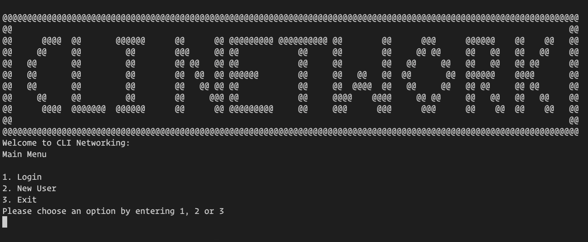

    - The user is prompted to choose one of the menu options by entering the option number.  If the user enters an incorrect value an error message is displayed, then once the user presses Enter the screen is refreshed and the main menu is shown again.  

      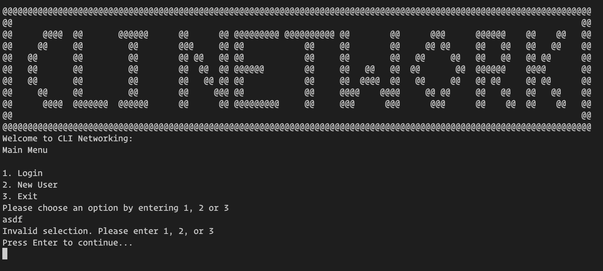

    - The main menu is repeatedly refreshed and re-displayed while inputs from the user are invalid and after each menu option 1 or 2 completes.  The application is terminated by selecting option 3 from the main menu.

- ###  __F02 User Login__
    - From the main menu, after selecting the option 1, user will be brought to the Login page (see image below). User are prompted to enter their username in this screen or hit enter to exit and go back to main menu. 

      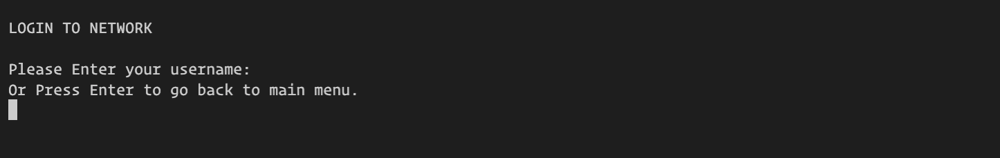

    - User will only be able to login if they already have created account and have accquired username. If username provided by user is not in database than user will be notified and redirected to main menu.

- ###  __F03 Create New User__
    - First time user who doesn't have account will have an option to create new user by going to option 2 (New User) from main menu. When user select option 2, user will be brough on below screen where user will have to answer few question related to themself to create account.

      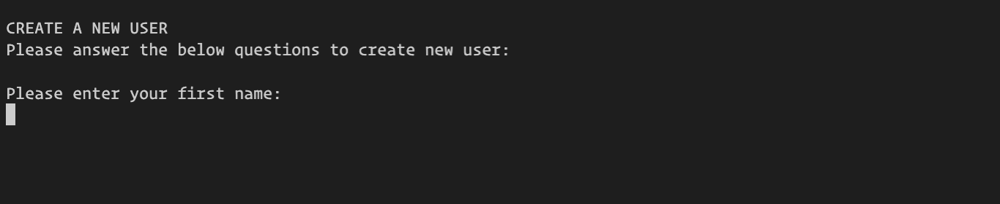

    - While user is entering the data, system will perform validation to make sure user is giving correct data. System will check if the entered name is not numeric, given mobile number is valid UK Number, email address is in correct format and date of birth is in correct format and user is more than 13years old. System will also check if the username that user choose is not duplicate.
    - After entering all the required information, system will notify user that the user account have been created and display the username for user to login (see image below). User will be prompt to hit enter to continue and will redirected to main menu.

      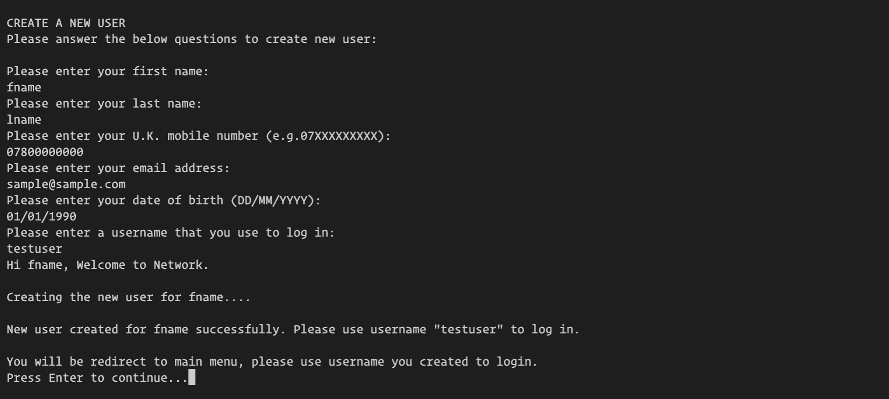

- ###  __F04 Login menu__
    - When user enter correct username in login page, user will be redireted to login menu page(see image below). To keep the interface simple to use and uncluttered the menu divides the functionality into four sub-menus: 1) Update User Details, 2) Add Friends, 3) View Friends and 4) View Friend Requests.   

      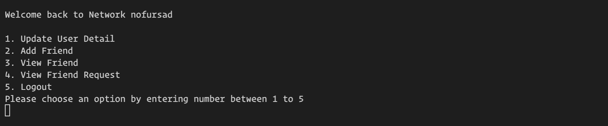

    - The login menu is repeatedly refreshed and re-displayed while inputs from the user are invalid and after each menu option 1 - 4 completes.  The user can logout of the system by selecting option 5 from the login menu.  

      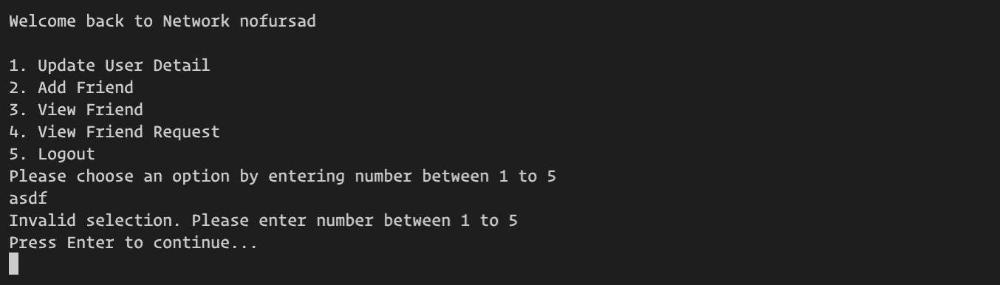

  
- ###  __F05 Update User Detail sub-menu__

    - When user selection option 1 from the login menu, user will be brough here and given the options to choose from to updated their own details or delete their own account (see the image below). User can going back to the login menu by selecting option 3.   

      

- ###  __F06 Add Friend sub-menu__

    - When user selection option 2 from the login menu, user will be brough here and given the options to find and add a new friends (see the image below). User can going back to the login menu by selecting option 2.   

      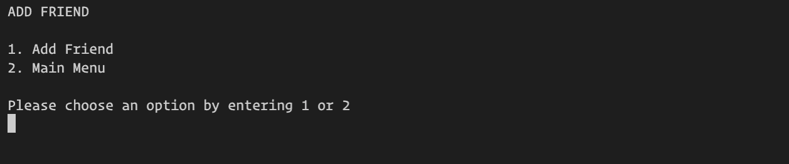

- ###  __F07 View Friends sub-menu__

    - When user selection option 3 in the login menu, user will be brough to View Friends Sub-menu (see image below). This Sub-menu divides the functionality into furthur 2 sub-menus: 1) View Friends and 2) Remove Friends. User can go back to login menu by selecting option 3.   

      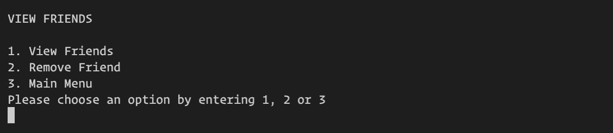

- ###  __F08 View Friend Requests sub-menu__

    - User will be brought to View Friend Requests sub-menu when they select option 4 in the login menu (see image below). To keep the interface simple to use and uncluttered the menu divides the functionality into four sub-menus: 1) Update User Details, 2) Add Friends, 3) View Friends and 4) View Friend Requests.   

      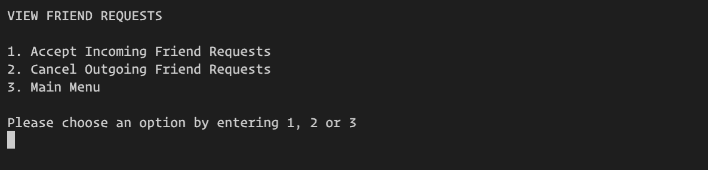

- ###  __F09 Logout__

    - When user is finished using the system and want to logout of the system, user will select option 5. User will be redirected to the main menu when user logout of the syste.  

- ###  __F10 Update User Information__

    - When user select option 1 from update user details sub-menu, user will be redirected to this page (see below image). Here user can update only his first name, last name, mobile number and email address. Validation process will be carried out at the background when user enter the data to make sure data is correct.   

      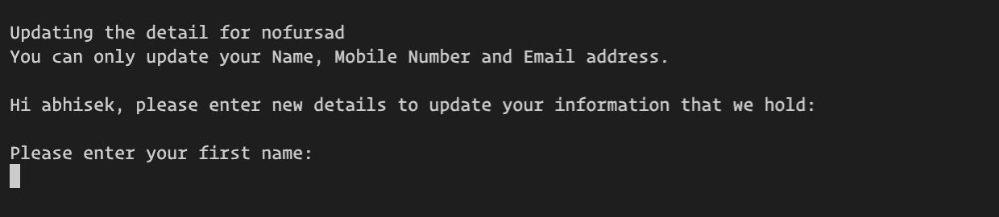

    - After user input all the data, system will update the user data in database and give the confirmation message about the update.   

- ###  __F11 Delete User__

    - When user select option 2 from update user details sub-menu, user will be redirected to this page (see below image). If user don't want to use the system anymore than user can delete their account from this option. User will be asked to enter the username to confirm the deletion of the account or type 'n' and hit enter to cancel the deletion process and go back to previous menu.   

      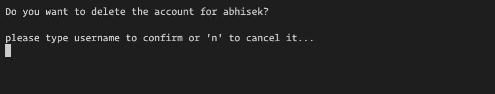

    - User will be asked to enter the username to confirm the deletion of the account or type 'n' and hit enter to cancel the deletion process and go back to previous menu (see the image below).   

      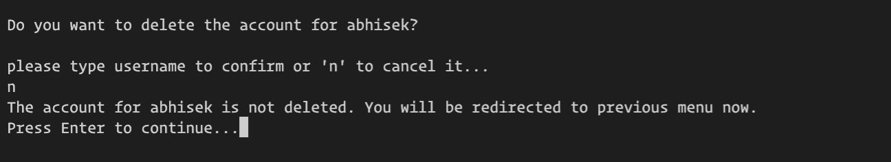

- ###  __F12 Add Friend__

    - User can select option .   

      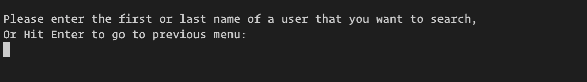

- ###  __F13 View Friends__

    - User will be brought to View Friend Requests sub-menu when they select option 4 in the login menu (see image below). To keep the interface simple to use and uncluttered the menu divides the functionality into four sub-menus: 1) Update User Details, 2) Add Friends, 3) View Friends and 4) View Friend Requests.   

      

- ###  __F14 Remove Friends__

    - User will be brought to View Friend Requests sub-menu when they select option 4 in the login menu (see image below). To keep the interface simple to use and uncluttered the menu divides the functionality into four sub-menus: 1) Update User Details, 2) Add Friends, 3) View Friends and 4) View Friend Requests.   

      

- ###  __F15 Accept Incoming Friend Requests__

    - User will be brought to View Friend Requests sub-menu when they select option 4 in the login menu (see image below). To keep the interface simple to use and uncluttered the menu divides the functionality into four sub-menus: 1) Update User Details, 2) Add Friends, 3) View Friends and 4) View Friend Requests.   

      

- ###  __F16 Cancel Outgoing Friend Requests__

    - User will be brought to View Friend Requests sub-menu when they select option 4 in the login menu (see image below). To keep the interface simple to use and uncluttered the menu divides the functionality into four sub-menus: 1) Update User Details, 2) Add Friends, 3) View Friends and 4) View Friend Requests.   

      

### Features which could be implemented in the future

- __Appropriate UI__

  As this application uses the command line interface it is not very user friendly for a human end-user.  An obvious future feature of this application would be to build a better user-interace layer using HTML/CSS and possibly Javascript to make it much more intuititve to use.

- __Extended Data Model__

  The data model representing the Events and Bookings is very simplistic in terms of the data elements it stores.  This could be extended to store additional data with more complex data relationship rules.  The data model and code could also be re-structured to use a better Object Oriented approach, where Events and Bookings could be handled as Object types with methods and attributes.

- __Extended Data Analysis__

  The Review Past Events feature of the application gives a breakdown of cancelled events vs events that weren't cancelled and shows % seats booked for those that went ahead.  Analysis of the data could be extended to find other information from the data, such as how frequently are certain events cancelled due to lack of bookings, which courses are most popular etc. and then this information could help the users plan ahead when trying to schedule events.  This type of information could also potentially be used to automate some tasks - e.g. automatically send an administrator an email highlighting a particular event has below a certain threshold of bookings coming up to it's scheduled date, so that the administrator has time to take action - e.g. send out a marketing email to draw attention to the event.

## Design

## Technologies Used

### Languages Used

-   [Python 3.8.10](https://www.python.org/)

### Frameworks, Libraries & Programs Used

-   [Google Spreadsheets:](https://en.wikipedia.org/wiki/Google_Sheets) used as the external data store for the Users and Connections data which is used in the project.
-   [Google Drive API:](https://developers.google.com/drive/api/v3/about-sdk) used to generate credentials to be used in the project to securely access the Google Spreadsheet to access the data. 
-   [Google Sheets API:](https://developers.google.com/sheets/api) used to support Creat, Read, Update and Delete functionality between the python code and data stored in the Google Spreadsheet.
-   [gspread:](https://docs.gspread.org/en/latest/) Python API for Google Sheets
-   [Google Auth:](https://google-auth.readthedocs.io/en/master/) Google authentication library for Python is required to use the credentials generated to access Google Drive API
-   [Git:](https://git-scm.com/) was used for version control by utilising the Gitpod terminal to commit to Git and Push to GitHub.
-   [GitHub:](https://github.com/) is used as the respository for the projects code after being pushed from Git.
-   [Heroku:](https://heroku.com) is used to deploy the application and provides an enviroment in which the code can execute

## Testing

### Validator Testing

- [Python Validator]

    - result for `run.py`

      ![Python Validation Results]

### Test Cases and Results

- The below table details the test cases that were used, the results and a cross-reference to the Feature ID that each test case exercised (click to open image):

  

    
Test Cases

    ![Test Cases]
  

  

### Known bugs

- List of the bugs
## Deployment

### How to clone the GitHub repository to work on duplicate file
  
  

    
Follow the below steps to create the clone of project

  
   1. Go to the [https://github.com/nofursad/ms3-clinetwork.git](https://github.com/nofursad/ms3-cli-network.git) to access the repository on GitHub.
   2. Click on the "Code" button which will bring a dropdown box with more option.
   3. Click on the HTTPs and click on copy icon next to the link.
   4. Open a GitBash terminal / build-in terminal and open a directory where you want to clone it.
   5. Type "git clone" them paste in the link that was copied from git and hit Enter to start the cloning process. 
   6. Any changes made to the local clone can be pushed back to the repository using the following commands :

          a. git add *filenames*  (or "." to add all changed files)  
          b. git commit -m *"text message describing changes"*  
          c. git push  
      
   - N.B. As automatic deployments is enabled for this project in Heroku, any changes made and pushed to the master branch will take effect on the live project.

   - N.B. Any kind of changes to data made through the use of the application will take effect in the live project data file "Networking" in Google spreadsheet.
   

### How to create and configure the Google spreadsheet and APIs
  
  

    
Follow the below steps to setup google spreadsheet file and configure access to data

  - Create the Google Spreadsheet 

     - Log in to your Google account (create one if necessary)
     - Create a Google Spreadsheet called 'ms3-cli-network' on Google Drive with 2 pages/sheets, one called 'users' and one called 'connections'.  
     - In row 1 of the users sheet, enter the headings : fname, lname, mobile, emailid, dob, username, user_created_time, ID.
     - In row 1 of the connections sheet, enter the headings : sender_id, receiver_id, connected.
     - The initial sample data used in this project can be seen here, however it is not necessary to use that data : [Content](#content)

  - Set up APIs using the Google Cloud Platform

     - Access the [Google Cloud Platform](https://console.cloud.google.com/)
     - Create a new project and give it a unique name, then select the project to go to the project dashboard
     - Setup Google Drive credentials 

        - Click on the hamburger menu in the top left of the screen to access the navigation menu
        - On the left hand menu select 'APIs and Services' and then 'Library'
        - Search for Google Drive API
        - Select Google Drive API and click on 'enable' to get to the API and Services Overview page 
        - Click on the Create Credentials button near the top left of the screen
        - Select 'Google Drive' API from the dropdown for 'Credential Type'
        - Select the 'Application Data' radio button in the 'What data will you be accessing' area
        - Select the 'No, I'm not using them' for the 'Are you planning to use this API with Compute Engine, Kubernetes Engine, App Engine, or Cloud Functions?' area
        - Cick Next
        - On the Create Service Account page, step 1 is to enter a service account name in the first text box.  Any value can be entered here.
        - Click on 'Create and Continue'
        - On step 2, 'Grant this service account access to project',  select Basic -> Editor from the 'Select a Role' dropdown.
        - Click on Continue
        - On step 3, 'Grant users access to this service account', simply press Done, no input is necessary
        - On the next page, click on the service account name created (listed under the Service Accounts area) to go to the configuration page for the new service account.
        - Click on the KEYS tab at the top middle of the screen.
        - Click on the Add Key dropdown and select Create New Key.
        - Select the JSON radio button then click Create. The json file with the new API credentials will download your machine. 
        - Rename the downloaded file to creds.json.  This filename is already listed in the project .gitignore file and so no further action will be needed to prevent it being accidentally uploaded to github 
        - Copy the new creds.json file into the local clone
        - In the creds.json file, copy the value for "client email" and then on Google Drive, share the spreadsheet created above with this email address assigning a role of Editor similar to the image shown below :

          

     - Enable Google Sheets API 
        
        - Go back to the dashboard for the project on Google Cloud Platform and access the navigation menu as before
        - On the left hand menu select 'APIs and Services' and then 'Library'
        - Search for Google Sheets API
        - Select Google Sheets API and click on 'enable'

  - Install gspread and google-auth libraries in the development environment using the command 'pip3 install gspread google-auth'
  
  

### How this site was deployed to Heroku 
   
  

    
Steps followed to deploy

  - The requirements.txt file in the project was updated to include details on the project dependencies. Steps to do this are :

    -  Enter the following command at the terminal prompt : 'pip3 freeze > requirements.txt'
    -  Commit resulting changes to requirements.txt and push to github

  - Log in to [Heroku](https://heroku.com/), create an account if necessary.
  - From the Heroku dashboard, click the Create new app button.  For a new account an icon will be visible on screen to allow you to Create an app, otherwise a link to this function is located under the New dropdown menu at the top right of the screen.
  - On the Create New App page, enter a unique name for the application and select region.  Then click Create app.
  - You will then be brought to the Application Configuration page for your new app.  Changes are needed here on the Settings and Deploy tabs.
  - Click on the Settings tab and then scroll down to the Config Vars section to set up the private Environment Variables for the application - i.e. the credentials used by the application to access the spreadsheet data.
  - Click on Reveal Config Vars.  In the field for key enter 'CREDS' and paste the entire contents of the creds.json file into the VALUE field and click ADD. A description on the creation of the creds.json file is documented in  [How to create and configure the Google spreadsheet and APIs](#how-to-create-and-configure-the-google-spreadsheet-and-apis) above.
  - Next, scroll down the Settings page to Buildpacks.  Click Add buildpack, select Python from the pop up window and click on Save changes.  Click Add buildpack again, select Node.js from the pop up window and click on Save changes.  It is important that the buildpacks are listed Python first, then Node.js beneath.
  - Click on the Deploy tab on the Application Configuration page.
  - Select GitHub as the Deployment Method and if prompted, confirm that you want to connect to GitHub.  Enter the name of the github
repository (the one used for this project is https://github.com/elainebroche-dev/ms3-event-scheduler) and click on Connect to link up the Heroku app to the GitHub repository code.
  - Scroll down the page and choose to either Automatically Deploy each time changes are pushed to GitHub, or Manually deploy - for this project
Automatic Deploy was selected.
  - The application can be run from the Application Configuration page by clicking on the Open App button.
  - The live link for this project is (https://ms3-event-scheduler.herokuapp.com/)

 

## Credits 

### Code 
- Code to clear the screen was taken from this website : [Clear Screen](https://www.geeksforgeeks.org/clear-screen-python/) 
- Code on validate the U.K. mobile number was taken from this website : [U.K. Mobile number validation](https://pypi.org/project/phonenumbers/)
- Code to format and manipulate the date and time was taken from this website : [Datetime manipulation](https://docs.python.org/3/library/datetime.html)
- Code to manipulate the data on google sheet using gspread API came from this website : [GSPREAD API](https://docs.gspread.org/en/latest/user-guide.html#getting-all-values-from-a-worksheet-as-a-list-of-lists)
- Code to print data in a table on screen using tabulate library came from information on this website : [Table Formatting](https://pypi.org/project/tabulate/)
- Code to use an in-built RE package to validate format of email address came from information on this website : [Email Validation using RE](https://www.geeksforgeeks.org/check-if-email-address-valid-or-not-in-python/)

### Acknowledgments

- Thank you to my mentor Brian Macharia for his ongoing help and feedback.  He has provided me with lots of tips and resources to help improve my coding and testing.